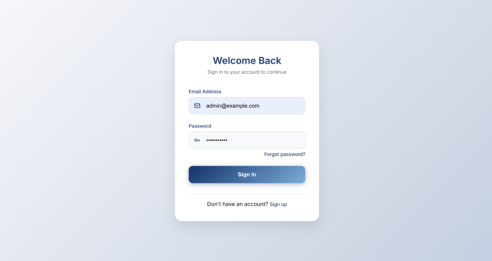
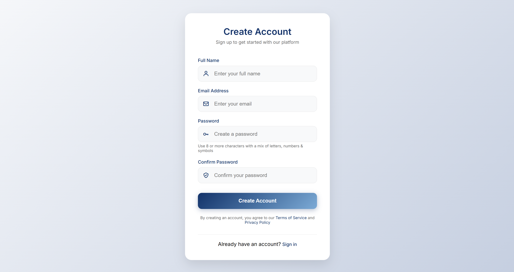
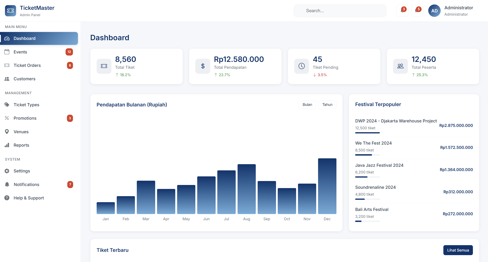
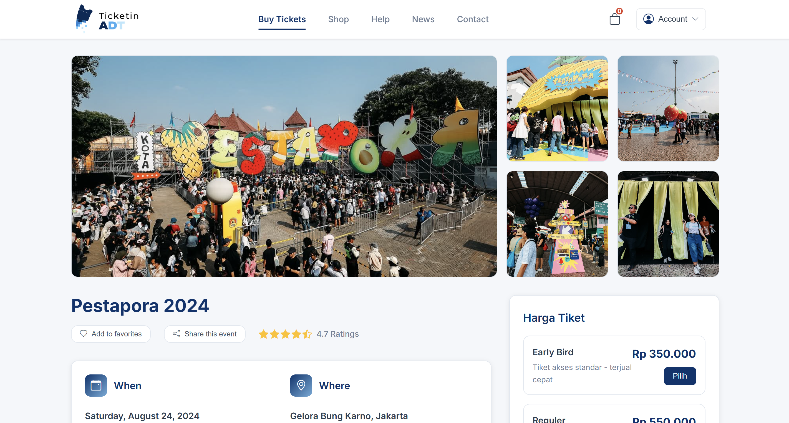

# 🎟️ TicketADT — Sistem Pembelian Tiket (Seleksi Magang)

TicketADT adalah sistem **pembelian tiket berbasis web** yang dikembangkan sebagai bagian dari proyek seleksi magang.  
System ini memiliki dua sisi utama:
- **Admin Panel** → tempat admin membuat dan mengelola event.
- **User Panel** → tempat pengguna membeli tiket untuk event yang telah dibuat.

---

## 🧭 Alur Utama Sistem

System ini masih dalam tahap **setengah jadi**, namun sudah memiliki alur utama sebagai berikut:

1. **User dan Admin dapat melakukan registrasi serta login.**
2. **Admin** dapat mengakses **Dashboard** dan nantinya akan bisa membuat event.
3. **User** dapat mengakses halaman **Buy Ticket** untuk melihat dan membeli event yang tersedia.
4. Sistem akan dikembangkan agar **aliran kerja Admin → Event → Pembelian oleh User** berjalan sempurna.

---

## 🔐 Kredensial Login

| Role | Email | Password |
|------|--------|-----------|
| **Admin** | `admin@example.com` | `password123` |
| **User** | `user@example.com` | `password123` |

---

## 🧱 Struktur Halaman

### 🔸 Halaman Autentikasi
Sistem mendukung **registrasi** dan **login** untuk dua role: admin & user.  
Berikut tampilan antarmuka login dan registrasi:

| Login | Register |
|-------|-----------|
|  |  |

---

### 🔸 Admin Panel

Setelah berhasil login sebagai **Admin**, pengguna diarahkan ke halaman **Dashboard**.  
Dashboard ini merupakan pusat kontrol untuk mengelola sistem event dan tiket.

| Admin Dashboard |
|-----------------|
|  |

#### 📋 Menu Utama Admin
Tampilan sidebar admin mencakup beberapa menu berikut:

**Main Menu**
- 🏠 **Dashboard** — Ringkasan informasi utama.
- 📅 **Events** — (akan diaktifkan) untuk membuat dan mengelola event.
- 🎟️ **Ticket Orders** — Data pembelian tiket oleh user.
- 👥 **Customers** — Daftar pengguna yang membeli tiket.

**Management**
- 🏷️ **Ticket Types** — Mengatur kategori tiket (misal: VIP, Regular).
- 💸 **Promotions** — Menambahkan promo atau potongan harga.
- 📍 **Venues** — Lokasi tempat event berlangsung.
- 📊 **Reports** — Laporan penjualan tiket.

**System**
- ⚙️ **Settings** — Pengaturan sistem dan profil admin.
- 🔔 **Notifications** — Notifikasi terkini.
- ❓ **Help & Support** — Bantuan dan dokumentasi.

📌 *Pada tahap saat ini, menu-menu tersebut masih dalam bentuk struktur tampilan (UI), dan akan dikembangkan lebih lanjut agar berfungsi penuh.*

---

### 🔸 User Panel

Setelah login sebagai **User**, pengguna diarahkan ke halaman **Buy Tickets** yang menjadi pusat pembelian tiket.

| Buy Ticket |
|-------------|
|  |

#### 📜 Menu Navigasi User
- 🎟️ **Buy Tickets** → Halaman utama untuk melihat event yang tersedia.
- 🛍️ **Shop** → Deretan event - event yang tersedia.
- 🆘 **Help** → Bantuan pengguna.
- 📰 **News** → Informasi event atau berita terbaru.
- 📞 **Contact** → Halaman kontak admin.
- 👤 **My Profile** → Data akun pengguna.
- 🎫 **My Tickets** → Tiket yang telah dibeli.
- 🚪 **Logout** → Keluar dari sistem.

---

## ⚙️ Alur Logika Kerja Sistem

Berikut alur kerja utama (main flow) dari sistem ini:

1. **Admin login** ke sistem.  
   Admin akan diarahkan ke **Dashboard**.

2. **Admin membuat event baru.**  
   (Fitur ini akan dikembangkan agar admin dapat mengisi nama event, tanggal, lokasi, harga tiket, kapasitas, dan gambar event.)

3. **User login** dan masuk ke halaman **Buy Ticket**.  
   Sistem akan menampilkan daftar event yang telah dibuat admin.

4. **User memilih event dan membeli tiket.**  
   Sistem mencatat data pembelian dan mengurangi jumlah stok tiket yang tersedia.

5. **Admin dapat melihat daftar pembelian tiket (Ticket Orders).**  
   Dari sini, admin bisa memantau penjualan dan melakukan laporan.

> 💡 **Catatan:** Alur ini sudah dirancang di tahap awal agar mudah dikembangkan. Tim pengembang selanjutnya bisa menambahkan detail fungsi sesuai kebutuhan.

---

## 🧩 Pengembangan Selanjutnya

Agar sistem ini menjadi lebih sempurna dan layak untuk digunakan secara nyata, berikut ide pengembangannya:

1. **Event Management Functionality**  
   - Form pembuatan event (nama, deskripsi, tanggal, lokasi, harga, kuota).  
   - Upload gambar event.

2. **Manual Payment System**  
   - Gunakan sistem pembayaran **manual (transfer bank / upload bukti pembayaran)** agar lebih mudah diimplementasikan tanpa integrasi API.  
   - Admin dapat melakukan **verifikasi pembayaran secara manual** di halaman Ticket Orders.

3. **Ticket Verification System**  
   - QR Code unik untuk setiap tiket pembelian agar dapat diverifikasi saat check-in.

4. **Notification & Email System**  
   - Mengirimkan notifikasi atau email konfirmasi setelah pembelian tiket berhasil.

5. **Report & Analytics Dashboard**  
   - Menampilkan grafik penjualan tiket per event untuk memantau performa.

6. **Search & Filter Event**  
   - Memudahkan user mencari event berdasarkan kategori, tanggal, atau lokasi.

7. **User Experience (UX) Enhancements**  
   - Konfirmasi pembelian, tampilan tiket digital, dan sistem refund sederhana.

8. **Export & Print Feature**  
   - Cetak tiket atau laporan penjualan ke format PDF / Excel.

---
## 🧠 Catatan Akhir

README ini menjelaskan **alur utama sistem TicketADT** secara garis besar.  
Detail implementasi backend dan logika tambahan sengaja tidak dijabarkan agar pengembang selanjutnya dapat mengembangkan sendiri sesuai logika kerja sistem yang diinginkan.

> 📌 Fokus utama sistem ini:  
> - Admin → Buat Event  
> - User → Beli Tiket  
> 
> Detail tambahan seperti pembayaran, laporan, promosi, dan validasi tiket dapat dikembangkan secara modular.

---

© 2025 — TicketMaster System (Seleksi Magang)
